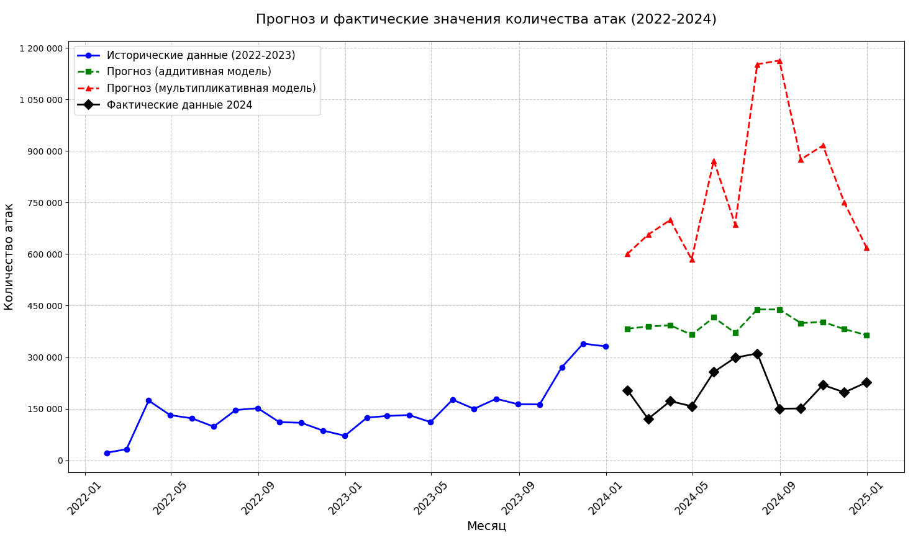
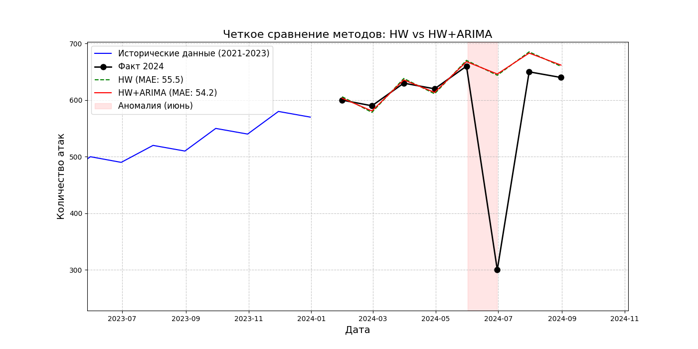

# Holt-Winters

Данный проект реализован с целью исследования метода
прогнозирования временных рядов, при помощи модели
Хольта-Винтерса. 

В перспективе, метод будет подвергаться изменениям,
например, путём комбинирования его с другими моделями.

Основной код - "main.py".

Реализация возможной модерниации - "hw+arima.py"

## Метод Хольта-Винтерса
Прицип работы следующий. Функция "prepare_data()" отвечает
за загрузку исходных данных (значения временного ряда). 
Исходные данные лежат в массиве "historical_data".
В словаре "actual_2024" указаны актуальные значения 
за год, на который будет произвоиться прогноз.

Результатом работы программы служит график сравнения
результатов, а также терминальный вывод прогнозируемых
значений и значения метрик ошибок.

Прогноз на графике не сошёлся по причине не соответсвия
исходных данных. Они не обладали закономерностями.
Используя закономерные последовательности
прогноз окажется успешным.

## Хольт-Винтерс & ARIMA
В настоящее время тестовая программа находится в файле 
"hw+arima.py". Это крайне сырая вырсия, которая обязательно
будет подвергнута доработке.

В качестве временного ряда были выбраны 
значения, обладающе закономерностью и
аномальным скачком. 