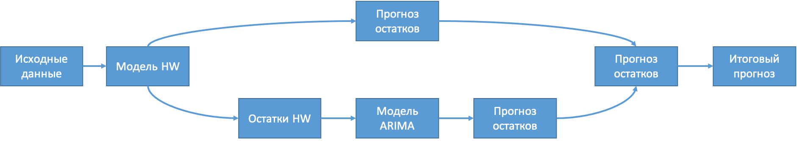
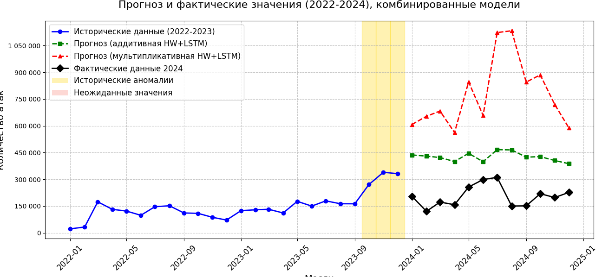

# Holt-Winters


Данный проект реализован с целью исследования метода
прогнозирования временных рядов, при помощи модели
Хольта-Винтерса и его возможными модификациями. 


__Действующая структура проекта:__
```
/Holt-Winters
│   main.py              # Основной скрипт
│   config.py            # Конфигурация
│
├───core/                # Вычислительное ядро
│   │   models.py        # Функции моделей
│   │   calculations.py  # Вычисления и метрики
│   │   preprocessing.py # Подготовка данных
│
└───utils/
    │   visualization.py # Визуализация
```
- *main.py* - программа и функции
- *config.py* - файл конфигураций
- *requirements.txt* - библиотеки и зависимости


## Метод Хольта-Винтерса

Функция *prepare_data()*, располагается в файле
*preprocessing.py* и отвечает за обработку
значений временного ряда. Исходные данные заносятся
в файл *config.py*, в массив *historical_data*,  - 
их число должно быть кратно 12. В *actual_data*
указываются значения последнего года. Это необходимо для
сравнения фактических и прогнозных значений.


Результатом работы программы служит график сравнения
результатов, а также терминальный вывод прогнозируемых
значений и значения метрик ошибок.


Прогноз на графике не сошёлся по причине не соответсвия
исходных данных. Они не обладали закономерностями.
Используя закономерные последовательности
прогноз окажется успешным.

## Хольт-Винтерс & ARIMA




В качестве временного ряда были выбраны 
значения, обладающе закономерностью и
аномальным скачком.

## Хольт-Винтерс & LSTM
