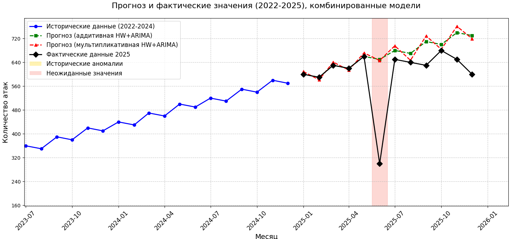

# Holt-Winters


Данный проект реализован с целью исследования метода
прогнозирования временных рядов, при помощи модели
Хольта-Винтерса. 

В перспективе, метод будет подвергаться изменениям,
например, путём комбинирования его с другими моделями.

__Действующая структура проекта:__
- *main.py* - программа и функции
- *config.py* - файл конфигураций
- *requirements.txt* - библиотеки и зависимости

__hw+arima.py__ - реализация возможной модерниации. Не
является готовым решением. Крайне сырой код.

## Метод Хольта-Винтерса
Прицип работы следующий. Функция *prepare_data()* отвечает
за обработку исходных данных (значения временного ряда). 
Исходные данные заносятся в файл __config.py__
в массив *historical_data*. В *actual_data* заносятся 
актуальные данные последнего года. Это необходимо для 
сравнения фактических и прогнозных значений.


Результатом работы программы служит график сравнения
результатов, а также терминальный вывод прогнозируемых
значений и значения метрик ошибок.


Прогноз на графике не сошёлся по причине не соответсвия
исходных данных. Они не обладали закономерностями.
Используя закономерные последовательности
прогноз окажется успешным.

## Хольт-Винтерс & ARIMA
В настоящее время тестовая программа находится в файле 
"hw+arima.py". Это крайне сырая вырсия, которая обязательно
будет подвергнут доработке.

__При отсутствии совместимости библиотек:__
```
pip uninstall numpy pmdarima -y
pip install numpy==1.23.5 pmdarima==2.0.3

# matplotlib - v 3.9.1
```



В качестве временного ряда были выбраны 
значения, обладающе закономерностью и
аномальным скачком.